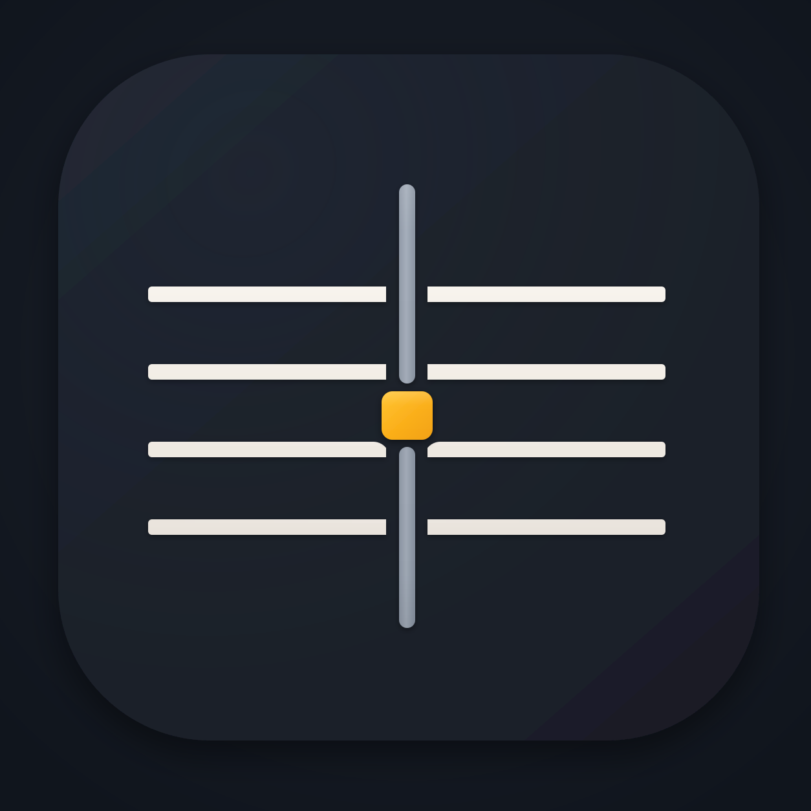

<div align="center">



# tab-edit

### The ASCII guitar tab you already know how to write — that finally knows what you mean.

Type `e|--0--2--3--|` and get real notation, real sound, and a real MusicXML/MIDI
file. No note entry. No mouse. No 90s Java applet.

**[▶ Try it live](https://tab-edit.vercel.app)** &nbsp;·&nbsp;
[Watch the 90-second tour](#-watch-it) &nbsp;·&nbsp;
[Why this is different](#why-this-is-different) &nbsp;·&nbsp;
[Run it locally](#run-it-locally)

<!-- 🎥 HERO SLOT — after recording, delete the italic line below and uncomment this:

-->

_🎬 **Hero GIF goes here.** Record it with **[docs/RECORDING-SCRIPT.md](docs/RECORDING-SCRIPT.md)** (Shot 1), save as `docs/media/hero.gif`, uncomment the line above._

</div>

---

## The 15-second version

Every guitarist on earth can read this:

```
e|-----------------|
B|-----------------|
G|-------------7---|
D|-----5h7---------|
A|---7-------------|
E|-0---------------|
```

Every piece of music software on earth treats it as **plain text**. tab-edit treats it
as **music**: columns are time, digits are frets on named strings, `h` is a hammer-on
— and the whole thing is a score it can play, engrave and export, while you type,
character by character.

That's it. That's the product.

## What it does

### 🎼 Notation, as you type

Your tab becomes a proper staff — or a TAB staff, one click — in the pane beside it.
Re-rendered on every keystroke, not behind a "compile" button.

<!-- 🎥 SLOT — Shot 2: typing turns into notation live.

-->
_🎬 `docs/media/notation.gif`_

### 🔊 Hear it — and see where you are

Press <kbd>Space</kbd>. The editor selection and the notation cursor both ride the
playhead. Drag across a few bars and only those bars play; drag down a single string
and that voice solos — because a selection here is a region of the **time × voice
grid**, not a blob of characters.

<!-- 🎥 SLOT — Shot 3: playback with the follow cursor + selection-scoped replay.

-->
_🎬 `docs/media/playback.gif`_

Hammer-ons, pull-offs, slides, bends and palm mutes are read as **techniques**: a bend
actually bends the pitch, a hammered note arrives softer. Drum tabs play as drums.

### 🧠 It reads tabs from the actual internet

Not a clean toy dialect — the real stuff people post: chord rows above the staff,
lyrics, beat-count rows, repeat brackets, `12x` multipliers, alternate tunings, capo
directives, side-by-side systems, Windows line endings, one file in Latin-1. The
parser is developed against a **32-file corpus of unedited real tabs**, from
16th-century lute pieces to Rush drum charts.

### 🩹 Mistakes explain themselves

Unnamed string, misaligned bar, a fret on a line that has no name — you get a
diagnostic exactly where the problem is, and where the fix is unambiguous, a
one-click action that edits the text for you. Undoable, like anything you typed.

<!-- 🎥 SLOT — Shot 4: a lint tint → click the fix → the tab repairs itself.

-->
_🎬 `docs/media/fix.gif`_

### 📤 Export that opens in real software

**MusicXML 4.0** (MuseScore, Sibelius, Dorico, Finale) and **format-0 MIDI** (any
DAW). Techniques survive the trip: hammer-ons and slides become notation marks, bends
become pitch-bend curves, drums land on channel 10 with the right noteheads. It
round-trips, too — import a MusicXML file you exported and you get the same tab back.

<!-- 🎥 SLOT — Shot 5: export → the file opening in MuseScore.

-->
_🎬 `docs/media/export.gif`_

## 🎥 Watch it

<!-- 🎥 VIDEO SLOT — paste the YouTube/Loom embed once recorded (script: docs/RECORDING-SCRIPT.md)
[](https://youtu.be/REPLACE_ME)
-->
_🎬 **90-second tour goes here** — link + thumbnail. Shot list and narration:
**[docs/RECORDING-SCRIPT.md](docs/RECORDING-SCRIPT.md)**._

## Why this is different

Tab is deceptively hard: a **2-D grid where horizontal position IS time**, with no
standard and a little dialect per transcriber. Most tools either ignore the semantics
(a text box) or make you re-enter the music in a note editor. tab-edit is the third
option, built like a language toolchain rather than a script:

|  |  |
|---|---|
| **Incremental to the keystroke** | A grammar-driven parse plus a semantic layer that *reuses* everything your edit didn't touch — type in bar 40 and bars 1–39 don't recompute. Measured: **1.25 ms p95 keystroke on a 100 KB document**, 99.7% artifact reuse across the corpus. |
| **Semantics, not regex** | Instruments, tunings, capos, exact rational time (no float drift), pitch resolution, techniques, measure numbering — a layered catalog of derived values, each carrying the evidence it was derived from. |
| **Interpretation over complaint** | Prose, chord rows and count rows are *recognized as such*, not error-spammed. A block claimed as lyrics stops being lint. |
| **Proof-first** | Decisions are argued in writing before they're coded, invariants are stated explicitly, and **~750 tests** across six repos — differential suites, seeded fuzz, a wild-corpus ratchet — keep them true. |
| **No lock-in** | The editor is CodeMirror 6 and your document is a `.txt` file. Nothing to migrate into, nothing to migrate out of. |

## Run it locally

```bash
npm install
npm run app          # http://localhost:5173
```

The app gets its semantics from a **session host** (see [Architecture](#architecture)).
Start one from the sibling `remote` repo:

```bash
cd ../remote/host && npm run dev-server     # ws://localhost:8787
# …or the real Cloudflare shell:  npx wrangler dev
```

> **Beta note:** the engine packages (`@tab-edit/parse`, `@tab-edit/ast`,
> `@tab-edit/plugins`) are private during the closed beta, so `npm install` here needs
> access to them. The hosted app needs nothing —
> [just open it](https://tab-edit.vercel.app). Want in?
> [Open an issue](../../issues) and say hi.

### Keyboard

|  |  |
|---|---|
| <kbd>Space</kbd> | play / pause — from the caret, or just the selection |
| drag | column (time-slice) selection: a chord, or one voice |
| <kbd>Cmd</kbd>/<kbd>Ctrl</kbd>+<kbd>F</kbd> | search |
| click a diagnostic | jump to it; click its action to apply the fix |

## Architecture

The editor is deliberately thin — CodeMirror 6 plus compiled grammar tables, so
**typing and syntax highlighting never wait for anything**. Semantics (parse →
properties → diagnostics/exports) run in a per-document session behind a small wire
protocol; the browser renders passive value snapshots and answers cursor/selection
questions locally at 0 ms.

```
browser                                   session host (one per open document)
┌───────────────────────────────┐        ┌───────────────────────────────────┐
│ CodeMirror 6 + grammar tables │ edits  │ incremental parse + semantic layer│
│ snapshot store (versioned,    ├───────►│ diagnostics · MusicXML · MIDI     │
│ mapped through local edits)   │◄───────┤ producer commands                 │
└───────────────────────────────┘ frames └───────────────────────────────────┘
```

One file — [`app/semantics-mode.ts`](app/semantics-mode.ts) — decides whether
semantics come off that wire or from an in-process engine. It is a single re-export
line: flip it and the same app runs fully local, no server at all.

| repo | what it is |
|---|---|
| **tab** (this one) | the app, the CodeMirror 6 integration, the dev/demo harness |
| **remote** | the wire protocol + session host (Node dev server & Cloudflare Durable Object) |
| **parse** | the Lezer grammar for tablature |
| **ast** | the incremental core: fragments, artifact reuse, the plugin state engine |
| **plugins** | the semantic catalog: instruments, pitch, time, techniques, exports |

## Use it as a library

The whole system is one CodeMirror extension:

```ts
import { basicSetup, EditorView } from "codemirror";
import { tablature, musicXml, midiFile, midiOfSelection } from "@tab-edit/cm";

const view = new EditorView({
  doc: "e|--0--2--|\nB|3-------|\n…",
  extensions: [basicSetup, tablature()],
});

musicXml(view.state);        // → MusicXML 4.0 (opens in MuseScore)
midiFile(view.state);        // → format-0 SMF bytes
midiOfSelection(view.state); // → events for the current (column) selection
```

Theming is data: a `TabThemeSpec` of semantic color slots compiled by `tabTheme()`,
every slot also a CSS variable (`--tabedit-fret`, …). The defaults dim the ~70% of
characters that are dash/barline lattice so notes pop by contrast, not by rainbow.

```bash
npm run type-check && npm test   # headless suites on real CM machinery
npm run verify:app               # Playwright: browser → WebSocket → session host
npm run demo                     # the dev harness (inspector, activity, AST panes)
```

## Status & roadmap

Working today: live notation, playback with score following, lint with fixes,
MusicXML/MIDI export **and import**, column selections, sample library, theming,
remote or fully-local operation.

In flight: richer percussion mapping, repeat/volta expansion in playback, error
messages that say *what, why, and how to fix it*, and a plugin marketplace — the
semantic layer is plugin-driven end to end, so an instrument pack or a house-style
linter is a small module, not a fork.

## Contributing

Issues tagged **good first issue** are real, scoped pieces of the roadmap, written
with enough context for a newcomer. Start there — or open an issue with a tab that
parses badly. A real-world file that breaks the parser is the single most useful bug
report this project can get.

## License

ISC © Stanley Ihesiulo
